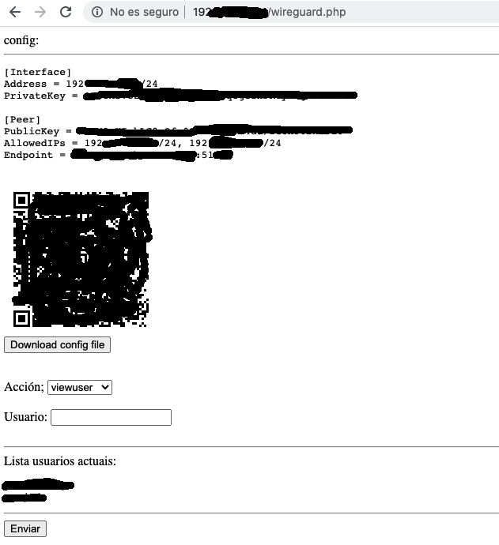

# wireguard and frontend 

simple wireguard frontend and fork from wg_config (https://github.com/adrianmihalko/wg_config)

## Install

 1. clone wg_config

 2. install wireguard (see https://github.com/adrianmihalko/raspberrypiwireguard and https://github.com/adrianmihalko/raspberrypiwireguard/wiki/User-management-with-Wireguard-User-Management-script)

 3. to use with lighttpd installed by [pihole](https://pi-hole.net/):

    `pi@raspberrypi:/var/www/html $ sudo ln -s /home/pi/wireguard/wg_config/wireguard.php .`

 4. remove ask for root password with sudo to user.sh script

```bash
pi@raspberrypi:~ $ sudo cat /etc/sudoers.d/wireguard_config
# permite empregar sudo ./user.sh de wg_config
#
www-data ALL=NOPASSWD: /home/pi/wireguard/wg_config/user.sh
www-data ALL=NOPASSWD: /usr/bin/wg
```

